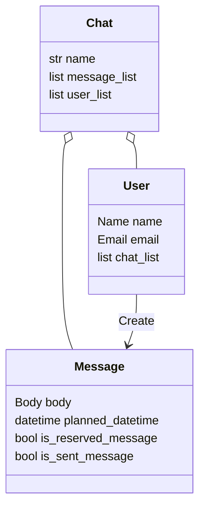

```mermaid
classDiagram
class User {
    Name name
    Email email
    list chat_list

}

class Chat {
    str name
    list message_list
    list user_list
    
}

class Message {
    Body body
    datetime planned_datetime
    bool is_reserved_message
    bool is_sent_message

}
Chat o-- User
Chat o-- Message
User --> Message: Create
```