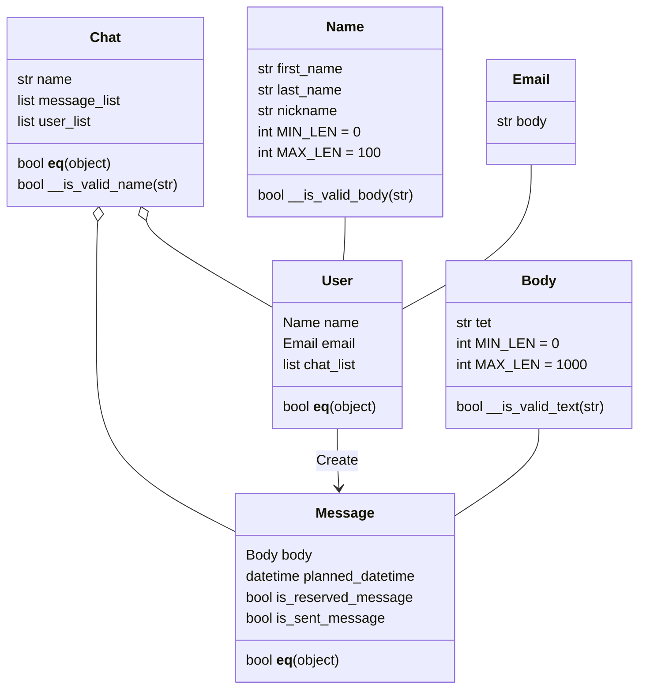

```mermaid
classDiagram
class User {
    Name name
    Email email
    list chat_list
    bool __eq__(object)
}

class Name {
    str first_name
    str last_name
    str nickname
    int MIN_LEN = 0
    int MAX_LEN = 100
    bool __is_valid_body(str)
}

class Email {
    str body
}
class Chat {
    str name
    list message_list
    list user_list

    bool __eq__(object)
    bool __is_valid_name(str)   
}

class Message {
    Body body
    datetime planned_datetime
    bool is_reserved_message
    bool is_sent_message
    bool __eq__(object)
}
class Body{
    str tet
    int MIN_LEN = 0
    int MAX_LEN = 1000
    bool __is_valid_text(str)
}
Chat o-- User
Chat o-- Message
User --> Message: Create
Name -- User
Email -- User
Body -- Message
```