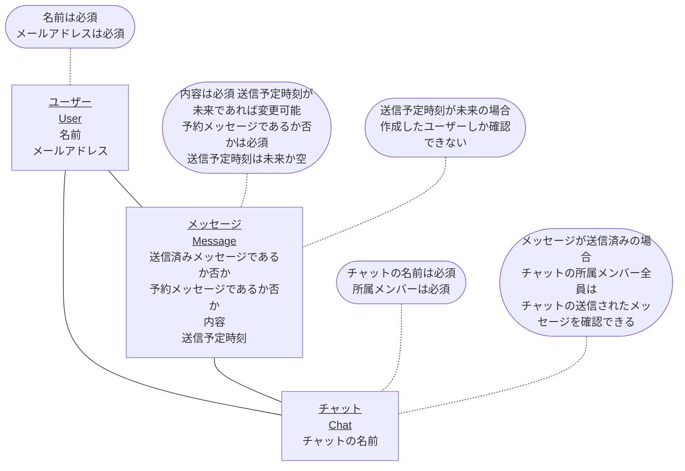

```mermaid
flowchart TB
user[<u>ユーザー<br>User</u><br>名前<br>メールアドレス]
message[<u>メッセージ<br>Message</u><br>送信済みメッセージであるか否か<br>予約メッセージであるか否か<br>内容<br>送信予定時刻]
chat[<u>チャット<br>Chat</u><br>チャットの名前]
user---chat
user---message
message---chat

user_1([名前は必須<br>メールアドレスは必須])
user_1-.-user
mes_1([内容は必須 送信予定時刻が未来であれば変更可能<br>予約メッセージであるか否かは必須<br>送信予定時刻は未来か空<br>])
mes_1-.-message
mes_2([送信予定時刻が未来の場合作成したユーザーしか確認できない])
mes_2-.-message

chat_1([チャットの名前は必須<br>所属メンバーは必須])
chat_1-.-chat
chat_2([メッセージが送信済みの場合<br>チャットの所属メンバー全員は<br>チャットの送信されたメッセージを確認できる])
chat_2-.-chat

```
