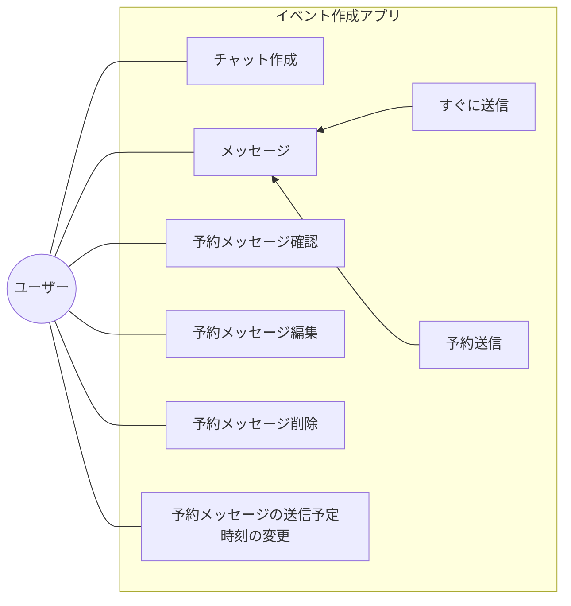

```mermaid
flowchart RL

user((ユーザー))

A[チャット作成] --- user
B[メッセージ] --- user
C[予約メッセージ確認] --- user
D[予約メッセージ編集] --- user
E[予約メッセージ削除] --- user
F[予約メッセージの送信予定時刻の変更] --- user
G[すぐに送信] --> B 
H[予約送信] --> B
subgraph イベント作成アプリ
  A
  B
  C
  D
  E
  F
  G
  H
end

```